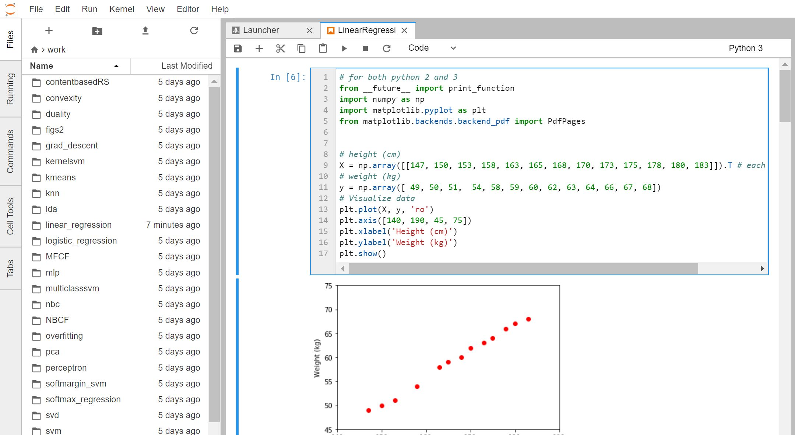

## Source code for "Machine Learning cơ bản" (Fundamentals of Machine Learning) book in Vietnamese 

## Order ebook at [https://fundaml.com/ebook](https://fundaml.com/ebook)

=====================================================

**Docker added by @hatung**

The project now includes a `Dockerfile` and a `docker-compose.yml` file (which requires at least docker-compose version `1.17.1`).

## Prerequisites

- Recent stable version of [Docker](https://www.docker.com/community-edition).
- Recent stable version of [Docker-compose](https://github.com/docker/compose/releases/latest).

## Setting up

Clone tiepvupsu/ebookML_src's repository.

    git clone https://github.com/tiepvupsu/ebookML_src.git
    cd ebookML_src

## Building the app

If you want to build your own image, run the command below:

    docker-compose build

you can launch the docker image with:

    docker-compose up
you can see these lines on screen
```
jupyterlab_1  |     Copy/paste this URL into your browser when you connect for the first time,
jupyterlab_1  |     to login with a token:
jupyterlab_1  |         http://localhost:8888/?token=8669f6fc0b665b67a5e08017c6728976cb41558a46ce561a
```
Copy/paste above URL and change port to 80  into your browser.


